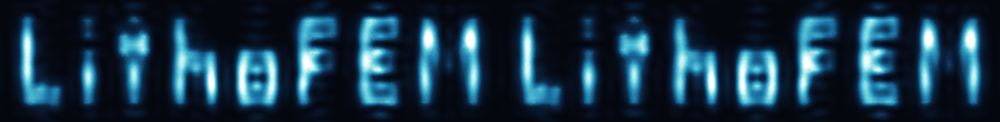

# LithoFEM



*The logo above is not a drawing: it is the solved near field 0.12 wavelengths
below a chrome mask whose cut-outs spell "LithoFEM" (2.06M complex unknowns,
GPU assembly + cuDSS; the glow, edge ringing and stroke-proximity effects are
physical diffraction). See [examples/logo/](examples/logo/) to reproduce it,
and [assets/logo_diffraction.png](assets/logo_diffraction.png) for the image
diffracting away from the mask.*

**Rigorous 3D electromagnetic near-field simulation for lithography masks**, using
frequency-domain vector finite elements on conformal tetrahedral meshes, with
GPU-accelerated assembly and a GPU sparse direct solver.

You describe a layered material stack, polygon-extruded (frustum) features and
light sources in a **single YAML file**; LithoFEM meshes the geometry, solves the
vector Maxwell equations, and writes near fields and diffraction orders.

```bash
lithofem run config.yaml -o results/
lithofem run config.yaml -o results/ --dry-run   # mesh, report size + GPU memory, stop
lithofem selftest                 # verify a fresh install (--full for the long tier)
```

Thin Python API (byte-for-byte identical to the CLI):

```python
import lithofem
lithofem.run("config.yaml", outdir="results/")
```

## What it does

- **Formulation** — time-harmonic vector Maxwell (`e^{-iωt}`), scattered-field
  formulation with an analytic transfer-matrix background, Bloch-periodic lateral
  boundaries, and a z-direction perfectly matched layer.
- **Discretization** — Nédélec H(curl) elements of arbitrary order on conformal
  tetrahedra (Gmsh OCC geometry), so sloped and non-Manhattan sidewalls are
  represented by the mesh rather than by staircase approximation.
- **Solvers** — complex sparse direct factorization on CPU (UMFPACK) or GPU
  (NVIDIA cuDSS), plus an optional preconditioned GMRES path.
- **GPU assembly** — hand-written CUDA kernels build the system matrix directly
  in device memory and hand it to cuDSS zero-copy; matrix values never travel to
  the host.
- **Outputs** — complex near fields on z-slices (HDF5), diffraction-order
  amplitudes and efficiencies (HDF5/CSV), high-order ParaView volume output.

## Performance

Measured end-to-end on a single NVIDIA H200 (1,344,564 complex DOF: EUV line
grating, cubic Nédélec elements, 10 elements per wavelength, 6° incidence):

| Stage | Time |
|---|---|
| GPU matrix assembly | 3.9 s |
| cuDSS factorization + solve | 8.4 s |
| **Full run** (mesh read → assembly → solve → near field, orders, ParaView) | **55 s** |

For reference, the same problem with CPU assembly takes 103 s in the assembly
stage alone (26× slower), and the pure-CPU v1 path (serial assembly + UMFPACK)
takes 438 s end-to-end. Speedups depend strongly on problem size; see
[docs/gpu.md](docs/gpu.md) for the full scaling table and how to reproduce it.

## Accuracy

Every layer of the code is pinned to an independent reference; all checks are
regression tests in `tests/`:

| Check | Reference | Result |
|---|---|---|
| Transfer-matrix module | closed-form Fresnel/TMM | machine precision |
| Assembly core | method of manufactured solutions, p = 1…6 | design convergence order |
| PML | reflection sweep | < 1e-6 |
| End-to-end multilayer | analytic TMM | ~8e-5 (discretization limited) |
| Local sources | analytic dipole Green's function | agreement to mesh accuracy |
| Patterned gratings | independent in-house RCWA implementation | < 1e-3 |
| Energy balance | flux conservation over all orders | ~1e-6 |
| GPU vs CPU assembly | element-wise matrix comparison | < 1e-13 |

See [docs/validation.md](docs/validation.md) for the full argument and measured
numbers.

## Minimal configuration

Six sections are enough to run; everything else has defaults.

```yaml
domain: {Lx: 96, Ly: 96, z_min: 0, z_max: 120}
materials:
  absorber: {n: 0.95, k: 0.031}      # or {epsilon: [re, im]}
layers:
  - {z: [0, 60], material: absorber}
frustums:
  - vertices: [[24, 24], [72, 24], [72, 72], [24, 72]]
    z0: 0
    h: 60            # may be negative (grows along -z)
    alpha: 85        # sidewall angle to the xy plane; default 90
    epsilon: 1.0     # vacuum (an etched hole) or a material name
wavelength: 13.5
sources:
  - type: planewave
    incidence: {theta: 6, phi: 0, from: top}
    polarization: s   # s | p | {jones: [[re, im], [re, im]]}
```

Full field reference: [docs/configuration.md](docs/configuration.md). Runnable
examples: [`examples/`](examples/).

## Outputs

| File | Contents |
|---|---|
| `g<group>_<name>.h5` | complex near field E/H on a z-slice, with full metadata |
| `orders_{up,down}_g<group>.{h5,csv}` | diffraction orders: complex s/p amplitudes, directions, z-flux, evanescent flags |
| `field_full_g<group>/` | ParaView high-order volume output (PML trimmed by default) |
| `run_log.jsonl` | JSON lines: mesh statistics, per-stage timings, residual |
| `config_snapshot.yaml`, `version.json`, `solve.json`, `mesh.msh` | reproducibility record |

## Installation

Requirements: Python ≥ 3.11, MFEM ≥ 4.9 (built with SuiteSparse; CUDA optional),
SuiteSparse, Gmsh (Python API). GPU paths additionally need CUDA and the cuDSS
library.

```bash
pip install -e .
tools/build_mfem.sh /path/to/mfem-4.9   # builds MFEM with the required flags
make solver                             # builds the C++ solver binaries
make test                               # runs the test suite
```

Build details, required flags and known pitfalls: [docs/building.md](docs/building.md).

## Physics conventions

Time convention `e^{-iωt}`, so lossy media have `Im ε > 0` and `ε = (n + ik)²`.
Lengths in nm, angles in degrees, `μ ≡ 1`. `z` is the stacking axis; `from: top`
places the source on the `z_max` side propagating along `−z`. Polarization basis
`ê_s = (ẑ × k̂)/|ẑ × k̂|` (so `ê_s = ŷ` at normal incidence) and `ê_p = k̂ × ê_s`.
Details in [docs/physics.md](docs/physics.md).

## Architecture

```
config.yaml → [validation / expansion (Python)]      → solve.json
            → [meshing (Python + Gmsh OCC)]          → mesh.msh (+ derived .v22/.per)
            → [assembly + solve (C++ / MFEM / CUDA)] → solution vector
            → [post-processing (Python)]             → HDF5 / CSV / ParaView
```

The stage boundaries are files, which makes stages replaceable: supply your own
`mesh.msh` (Gmsh 4.1 with the documented tag convention) to swap the mesher, or
use `--export-system` / `--import-solution` (Matrix Market complex format) to
plug in an external linear-algebra backend.

## Scope and limitations

LithoFEM solves the **electromagnetic** problem: it computes fields and
diffraction orders for a periodic unit cell or a small clip. It is intentionally
not a full-chip computational-lithography flow, and it does not yet include the
resist chain (exposure kinetics, post-exposure bake, development).

Because the default solver is a sparse *direct* factorization, memory bounds the
problem size: roughly 1.3M complex DOF needs ~35 GB of device memory, so a
140 GB GPU reaches a few million DOF. There is no MPI/domain decomposition; a
single problem runs on a single GPU, while independent parameter groups are
distributed across GPUs at the task level.

## License

LithoFEM is released under the [Apache License 2.0](LICENSE).

Note that LithoFEM builds on third-party components with their own licenses —
notably Gmsh and SuiteSparse (GPL) and NVIDIA cuDSS (proprietary). See
[THIRD_PARTY.md](THIRD_PARTY.md) before redistributing binaries.
